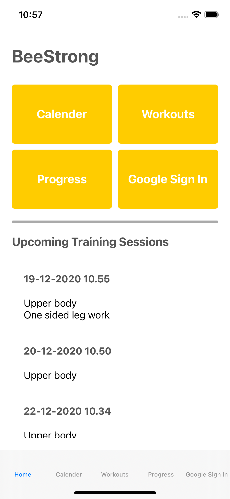
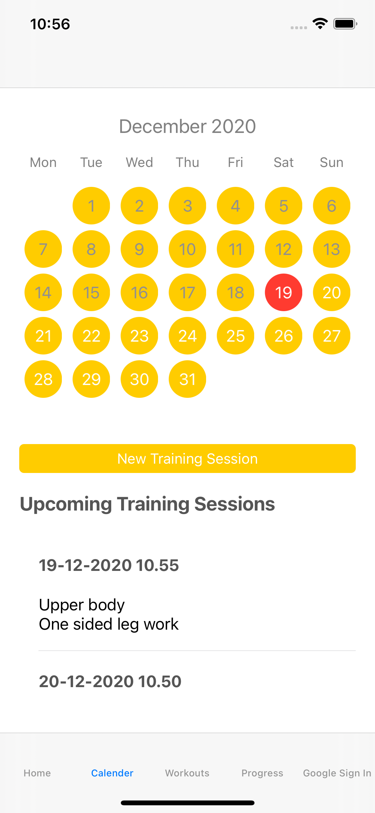
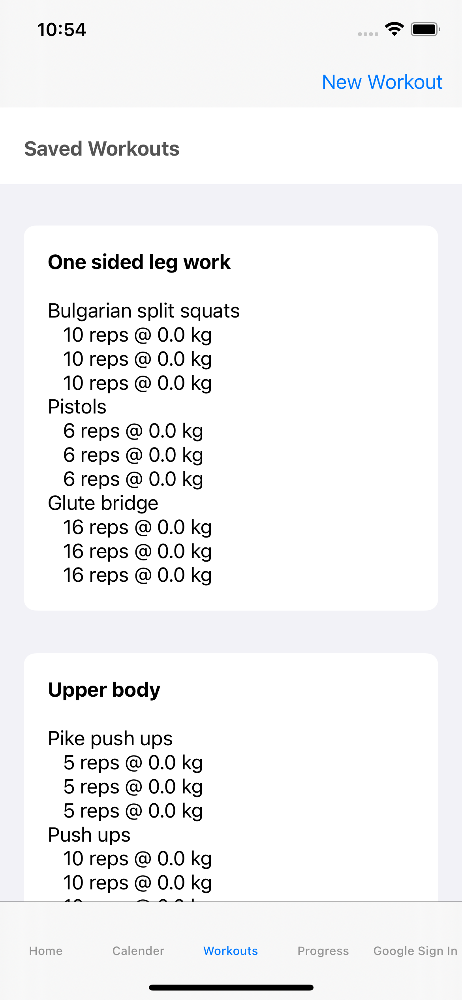
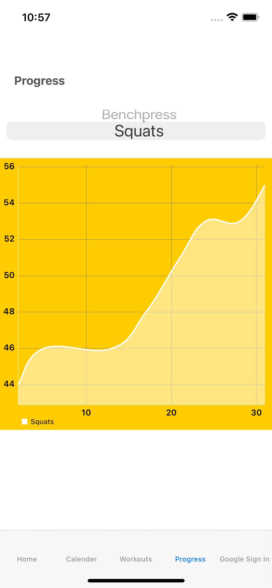
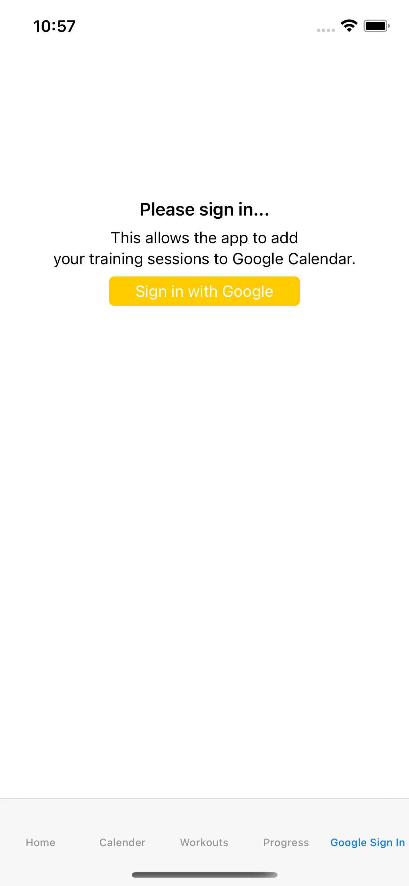
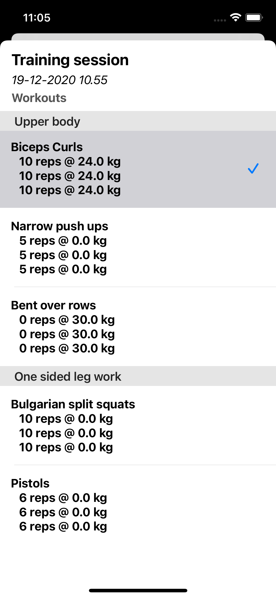

# BeeStrong 

  
Initial Project Description

  
Our idea is a fitness planning app. The user should be able to plan workouts for the future. The app should be able to save planned workouts in a database. The future workouts should be presented in a CollectionView. The user should be able to create calendar events that include the workout. These events should be created using calls to the Google Calendar API or a similar web service or external library. This depends on, which is the best solution. Google Calendar API supports both options.

This means that we use these two mandatory technologies as a minimum. Of course, we hope to implement more:

* Data storage 
* Web service calls 
  

BeeStrong is a fitness planning app. In the app, you will be able to create, plan, and view upcoming training sessions. 

### Project Requirements

* We have to be able to build your project without problems :heavy_check_mark:
* Your project has to be hosted on GitHub platform :heavy_check_mark:
* Multiple screens - multiple MVCs :heavy_check_mark:
* Table View or Collection View :heavy_check_mark:

Use at least two of the following:

| **Requirement**     | **Fulfilled**            | **Description**                                                                              |
|---------------------|--------------------------|----------------------------------------------------------------------------------------------|
| Data Storage        | :heavy_check_mark:       | Core Data and UserDefaults                                                                   |
| Web Service Calls   | :heavy_check_mark:       | Google API Client For REST                                                                   |
| Motion Sensors      | :x:                      |                                                                                              |
| Advanced Animations | :heavy_multiplication_x: | Graph Animation, however, not advanced                                                       |
| External Libraries  | :heavy_check_mark:       | [Google Calendar]() - Used for accessing Google Calender [GoogleSignIn]() - Used for authenticating the user [Charts](https://cocoapods.org/pods/Charts) - Libraries for adding charts [TinyConstraints](https://cocoapods.org/pods/TinyConstraints) - Styling of charts [KDCalender](https://cocoapods.org/pods/KDCalendar) - A custom calendar library |
| Multithreading      | :heavy_multiplication_x: | Usage of multithreaded API calls, however, the threading is not implemented by us            |

### Screenshots

### Get Started
1. Clone the project
2. Open the BeeStrong.xcworkspace file in Xcode
3. Choose a simulator (iPhone 12 Pro Max is recommended. See N.B. at the bottom)
4. Build and run the app
5. To create a workout
    * Navigate to Workouts
    * New Workout
    * Add Exercises
    * Create/Select Exercises
    * Save
    * Input title, sets, and reps
    * Save
6. To plan a training session
    * Navigate to the calendar
    * New Training Session (Optionally select a date. Can be done later)
    * Input title, date, start time, end time, and select workouts
7. During a training session
    * Navigate to the Home tab
    * Tap on an entry in the Upcoming Training Sessions
    * Tap exercises once you have completed them

### N.b.
Fitness apps are mostly used in portrait mode as using your phone in landscape mode during a workout makes little to no sense, however, some effort has been put into making it usable in landscape mode. The calendar tap in the app, using the iPhone 12 Pro Max simulator, will be presented correctly in landscape mode. This is, of course, doable for all device sizes, however, the time required for varying traits for all size classes is simply not feasible for the scope of this project. The app is best used in portrait mode.

© Hala Al-Janabi & Benjamin Eichler Staugaard & Sofie Louise Madsen
